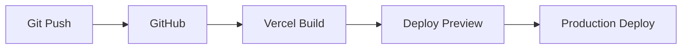

# 🚀 Vercel Deployment Guide

## 📋 Prerequisites

- ✅ **Vercel Account**: [Sign up at vercel.com](https://vercel.com)
- ✅ **GitHub Repository**: Code pushed to GitHub
- ✅ **Node.js 18+**: For build process
- ✅ **Build Success**: `npm run build` works locally

## 🔧 Quick Deployment Steps

### **Method 1: Vercel CLI (Recommended)**

1. **Install Vercel CLI**

   ```bash
   npm install -g vercel
   ```

2. **Login to Vercel**

   ```bash
   vercel login
   ```

3. **Deploy from Project Directory**

   ```bash
   # In your project root
   vercel

   # Follow the prompts:
   # ? Set up and deploy "~/neocare-frontend"? [Y/n] Y
   # ? Which scope do you want to deploy to? [Your Account]
   # ? Link to existing project? [y/N] N
   # ? What's your project's name? neocare-frontend
   # ? In which directory is your code located? ./
   ```

4. **Production Deployment**
   ```bash
   vercel --prod
   ```

### **Method 2: Vercel Dashboard**

1. **Connect GitHub Repository**

   - Go to [vercel.com/dashboard](https://vercel.com/dashboard)
   - Click "New Project"
   - Import your GitHub repository

2. **Configure Build Settings**

   ```
   Framework Preset: Vite
   Build Command: npm run build
   Output Directory: dist
   Install Command: npm install
   ```

3. **Deploy**
   - Click "Deploy"
   - Wait for build to complete

## ⚙️ Environment Variables

### **Production Environment Variables**

Add these in Vercel Dashboard → Project → Settings → Environment Variables:

```bash
# API Configuration
VITE_API_BASE_URL=https://your-backend-api.com/api
VITE_WEBSOCKET_URL=wss://your-backend-api.com

# Features
VITE_ENABLE_ANALYTICS=true
VITE_ENABLE_NOTIFICATIONS=true
VITE_LOG_LEVEL=error

# Optional: Custom Domain
VITE_CUSTOM_DOMAIN=https://neocare.medical
```

### **Development vs Production**

| Variable             | Development                 | Production                    |
| -------------------- | --------------------------- | ----------------------------- |
| `VITE_API_BASE_URL`  | `http://localhost:3000/api` | `https://api.neocare.medical` |
| `VITE_WEBSOCKET_URL` | `ws://localhost:3000`       | `wss://api.neocare.medical`   |
| `VITE_LOG_LEVEL`     | `debug`                     | `error`                       |

## 📁 Project Configuration

### **vercel.json Configuration**

```json
{
  "name": "neocare-frontend",
  "version": 2,
  "builds": [
    {
      "src": "package.json",
      "use": "@vercel/static-build",
      "config": {
        "distDir": "dist"
      }
    }
  ],
  "routes": [
    {
      "src": "/(.*)",
      "dest": "/index.html"
    }
  ]
}
```

### **Build Script**

Ensure your `package.json` has:

```json
{
  "scripts": {
    "build": "tsc -b && vite build",
    "preview": "vite preview"
  }
}
```

## 🔒 Security Headers

Vercel automatically applies security headers from `vercel.json`:

- ✅ **X-Frame-Options**: DENY
- ✅ **X-Content-Type-Options**: nosniff
- ✅ **Referrer-Policy**: strict-origin-when-cross-origin
- ✅ **Content-Security-Policy**: Configured for React app

## 🌍 Custom Domain

### **Add Custom Domain**

1. **In Vercel Dashboard**

   - Go to Project → Settings → Domains
   - Add your domain (e.g., `neocare.medical`)

2. **DNS Configuration**

   ```
   Type: CNAME
   Name: www (or @)
   Value: cname.vercel-dns.com
   ```

3. **SSL Certificate**
   - Vercel automatically provisions SSL certificates
   - HTTPS will be enforced

## 🚀 Deployment Workflow

### **Automatic Deployments**



- **Push to `main`** → Production deployment
- **Push to other branches** → Preview deployment
- **Pull Requests** → Preview deployments with URLs

### **Manual Deployments**

```bash
# Deploy current branch
vercel

# Deploy to production
vercel --prod

# Deploy specific directory
vercel --cwd ./dist
```

## 📊 Performance Optimization

### **Build Optimization**

```bash
# Analyze bundle size
npm run build
npx vite-bundle-analyzer

# Preview production build
npm run preview
```

### **Vercel Analytics**

Add to your project:

```bash
npm install @vercel/analytics
```

```typescript
// In main.tsx
import { Analytics } from "@vercel/analytics/react";

// Add to your app
<Analytics />;
```

## 🐛 Troubleshooting

### **Common Build Issues**

#### **1. React 19 Compatibility**

```bash
# If you get peer dependency errors
npm install --legacy-peer-deps
```

#### **2. TypeScript Errors**

```bash
# Check TypeScript configuration
npm run build

# Fix type errors
npx tsc --noEmit
```

#### **3. Environment Variables**

```bash
# Ensure VITE_ prefix for client-side variables
VITE_API_URL=https://api.example.com  ✅
API_URL=https://api.example.com       ❌
```

### **Build Logs**

Check build logs in Vercel Dashboard:

- Functions → View Function Logs
- Deployments → Click deployment → View Logs

### **Local Testing**

```bash
# Test production build locally
npm run build
npm run preview

# Test with production environment
VITE_API_BASE_URL=https://api.neocare.medical npm run build
```

## 🔄 Continuous Deployment

### **GitHub Integration**

1. **Automatic Deployments**

   - Every push to `main` deploys to production
   - Feature branches create preview deployments

2. **Branch Protection**
   ```yaml
   # .github/workflows/deploy.yml
   name: Deploy to Vercel
   on:
     push:
       branches: [main]
     pull_request:
       branches: [main]
   ```

### **Environment-based Deployments**

```bash
# Development
git push origin develop
# → Deploys to: https://neocare-frontend-git-develop.vercel.app

# Staging
git push origin staging
# → Deploys to: https://neocare-frontend-git-staging.vercel.app

# Production
git push origin main
# → Deploys to: https://neocare.medical
```

## 📈 Monitoring & Analytics

### **Vercel Analytics**

```typescript
// Add to your app
import { Analytics } from "@vercel/analytics/react";
import { SpeedInsights } from "@vercel/speed-insights/react";

function App() {
  return (
    <>
      {/* Your app */}
      <Analytics />
      <SpeedInsights />
    </>
  );
}
```

### **Performance Monitoring**

- **Core Web Vitals**: Automatically tracked
- **Real User Monitoring**: Built-in analytics
- **Speed Insights**: Performance recommendations

## 🎯 Production Checklist

### **Before Deployment**

- ✅ **Build Success**: `npm run build` works
- ✅ **Environment Variables**: Set in Vercel dashboard
- ✅ **API Endpoints**: Updated for production
- ✅ **SEO Meta Tags**: All pages have proper SEO
- ✅ **Error Handling**: 404 pages, error boundaries
- ✅ **Security**: HTTPS, security headers configured

### **After Deployment**

- ✅ **Functionality**: Test all features work
- ✅ **Mobile**: Test on mobile devices
- ✅ **Performance**: Check Core Web Vitals
- ✅ **SEO**: Test social media sharing
- ✅ **Analytics**: Verify tracking works
- ✅ **Monitoring**: Set up error tracking

## 🔗 Useful Links

- 📖 **Vercel Docs**: [vercel.com/docs](https://vercel.com/docs)
- 🛠️ **Vite Deployment**: [vitejs.dev/guide/static-deploy.html](https://vitejs.dev/guide/static-deploy.html)
- 🔧 **Environment Variables**: [vercel.com/docs/concepts/projects/environment-variables](https://vercel.com/docs/concepts/projects/environment-variables)
- 📊 **Analytics**: [vercel.com/docs/analytics](https://vercel.com/docs/analytics)

---

## 🎉 Your NeoCare App is Now Live!

After successful deployment, your app will be available at:

- **Production**: `https://your-project.vercel.app`
- **Custom Domain**: `https://neocare.medical` (if configured)

**Next Steps:**

1. Set up custom domain
2. Configure production API endpoints
3. Enable analytics and monitoring
4. Set up automated testing
5. Configure error tracking

🌟 **Congratulations on deploying your NeoCare medical application!** 🏥
